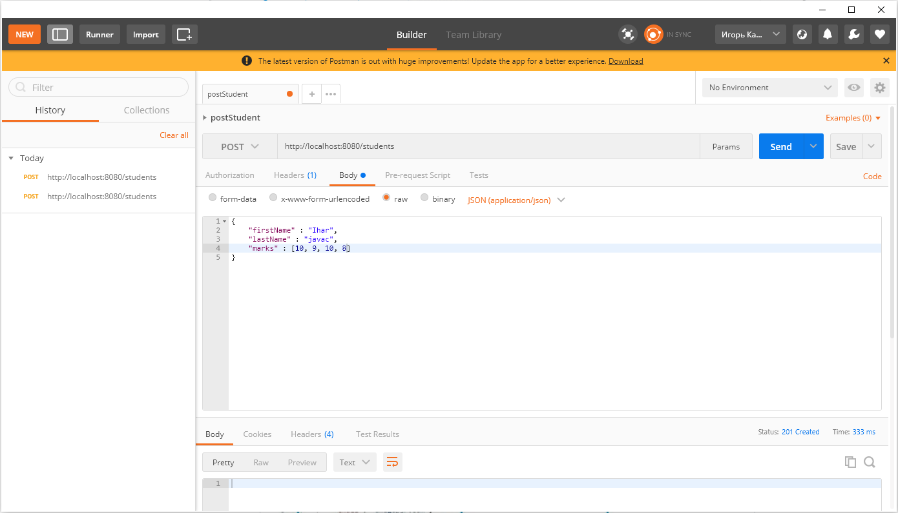
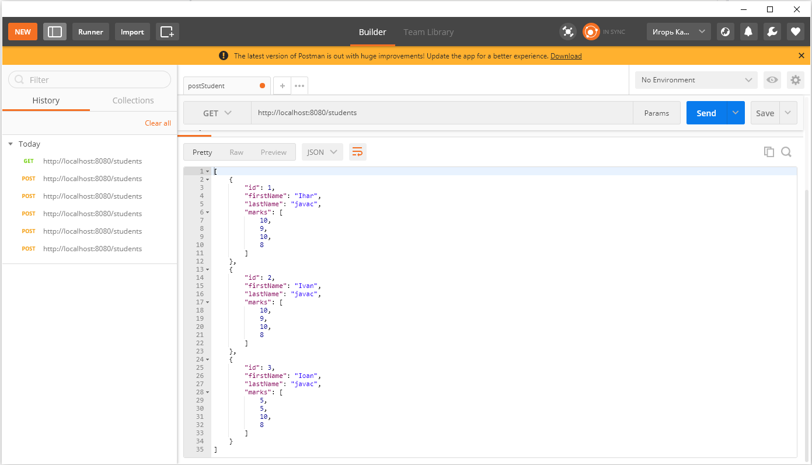
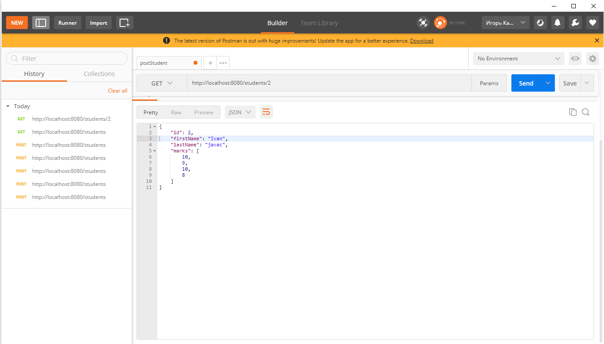
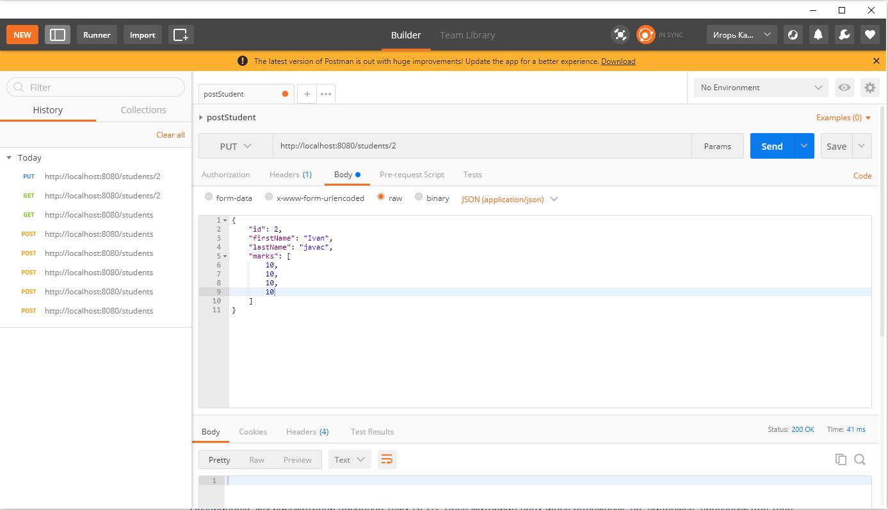
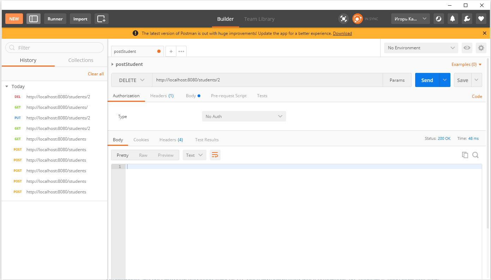

### Design a REST API

-------------------
>### Developer is Igor Koshman
***

#### Task

The goal of the task is to create a java application, develop and describe the REST API.

##### Steps:

- Describe, what entities must it use.
- Describe, what operations with these functions must the system support.
- Design REST API including collections, filters, pagination, etc.
- Provide the following results: A description of entities and operations, 
  a description of the REST API.

***

# Two solutions to this problem will be presented here. 1 using swagger, 2 using the tools provided by java

## Solution 1 (check project(students in group) studentAPI in Design_Rest_API and studentAPI.yaml)

> Only swagger will be used to complete the task

To accomplish this task, it was decided to create an application containing students in groups

###### Entities

- Group(groupId, groupName, studentsList)
- Student(studentId, firstName, lastName, marks)

###### Functions

- For Group:
  addGroup() - to add a new group
  updateGroup() - update an existing group
  getGroupList() - returns a list of group
  getGroupById(Integer groupId) - getting a group by its ID
  deleteGroupById(Integer groupId) - deleting a group by its id
  
- For Student
  addStudent() - to add a new student
  updateStudent() - update an existing student
  getStudentList() - returns a list of student
  getStudentById(Integer studentId) - getting a student by its ID
  deleteStudentById(Integer studentId) - deleting a student by its id
  
###### Design REST
```
1. GET /students   ---- collections
2. GET /students?limit=100   ---- limit
3. GET /students?pagination=true  ---- pagination

    api_platform:
      defaults:
        pagination_client_items_per_page: true
      collection:
        pagination:
          items_per_page_parameter_name: itemsPerPage   
```
```
  get:
    description: Returns a list of student
    parameters:
      - name: limit
        in: query
        description: Limits the number of items on a page
        schema:
          type: integer
      - name: offset
        in: query
        description: Specifies the page number of the students to be displayed
        schema:
          type: integer
          
  /group/{groupId}:
    get:
      description: Obtain information about an goup from her unique groupId
      parameters:
        - name: groupId
          in: path
          required: true
          schema:
            type: integer
            
  /group/student/{studentId}:
    get:
      description: Obtain information about an student from his unique studentId
      parameters:
        - name: studentId
          in: path
          required: true
          schema:
            type: string
```

## Solution 2 (check project Design_Rest_API(only students))

Spring Bolt, Java SE, JCF, Postman will be used to perform the task

###### Testing

<h2>
   
</h2>
<h2>
   
</h2>
<h2>
   
</h2>
<h2>
   
</h2>
<h2>
   
</h2>
  
### Materials and websites, used on the topic:

###### Websites

(https://swagger.io/)

###### Materials

- [OpenAPI Specification](https://swagger.io/docs/specification/about/) 
- [OpenAPI 3.0 Tutorial](https://support.smartbear.com/swaggerhub/docs/tutorials/openapi-3-tutorial.html)
- [Swagger/OpenAPI Specification](https://habr.com/ru/company/jugru/blog/525298/)
- [Create API in JAVA with Swagger](https://habr.com/ru/post/536388/)
- [REST API Best Practices](https://habr.com/ru/post/351890/)
- [Design for task](https://api-platform.com/docs/core/pagination/)
